<div align="center">


# HakkımVar

### Yapay Zekâ Destekli Kiracı Hak Asistanı

[](https://python.org)
[](https://langchain-ai.github.io/langgraph)
[](https://openai.com)
[](https://fastapi.tiangolo.com)
[](https://streamlit.io)
[](LICENSE)

**Türkiye'deki 40 milyonu aşkın kiracı için hukuki asistan**https://youtu.be/BfS_y94pE6Y

Kira sözleşmesinin fotoğrafını yükle → Saniyeler içinde yasadışı maddeleri gör → İhtarnameyi indir

[Sprint 1](Sprint1/) · [Sprint 2](Sprint2/) · [Yol Haritası](Road_Map1.pdf) · [Product Backlog](https://miro.com/app/board/uXjVH-kKWLY=/)

</div>

---

## İçindekiler

- [Proje Hakkında](#proje-hakkında)
- [Neden HakkımVar?](#neden-hakkımvar)
- [Özellikler](#özellikler)
- [Sistem Mimarisi](#sistem-mimarisi)
- [AI Agent Yapısı](#ai-agent-yapısı)
- [Model Seçim Kararları](#model-seçim-kararları)
- [Teknoloji Yığını](#teknoloji-yığını)
- [Kurulum](#kurulum)
- [Kullanım](#kullanım)
- [Proje Yapısı](#proje-yapısı)
- [Hedef Kitle](#hedef-kitle)
- [Sprint Geçmişi](#sprint-geçmişi)
- [Sprint 1 — Temel Altyapı](#sprint-1--temel-altyapı)
- [Sprint 2 — Kurulum ve Çalıştırma](#sprint-2--kurulum-ve-çalıştırma)
- [Takım](#takım)
- [API Endpoint Referansı](#api-endpoint-referansı)
- [Hukuki Uyarı](#hukuki-uyarı)

---

## Proje Hakkında

**HakkımVar**, Türkiye'deki kira krizinin tam ortasında doğdu.

İstanbul'da kiralar son 3 yılda ortalama %400 arttı. Adli yardım bürolarında 6–8 aylık bekleme listeleri oluştu. Tek bir avukat danışmanlığı ₺3.000–10.000 arasında değişiyor. Bu koşullar altında 40 milyon kiracının büyük çoğunluğu, ev sahiplerinin yasadışı taleplerine karşı haklarını öğrenemeden kabullenmek zorunda kalıyor.

HakkımVar bu boşluğu kapatıyor.

Kullanıcı kira sözleşmesinin fotoğrafını ya da metnini sisteme giriyor. LangGraph orkestrasyonuyla çalışan üç uzman ajan sırayla devreye giriyor: sözleşmeyi madde madde parse eden Contract Analyzer, her maddeyi Türk Borçlar Kanunu'na göre değerlendiren Legal Reasoner ve kullanıcıya haklarını sade Türkçeyle açıklayan Rights Advisor. Sistem gerektiğinde tek tıkla noter formatında ihtarname üretiyor.

> Bu uygulama hukuki tavsiye vermez; hukuki bilgi sağlar. Hukuk sistemine erişimi demokratikleştirmek için tasarlanmıştır.

---

## Neden HakkımVar?

### Sorun

| Veri | Kaynak |
|------|--------|
| Türkiye'de 40M+ kiracı | TÜİK 2024 |
| Son 3 yılda ortalama %400 kira artışı | TÜIK/TCMB |
| Avukat danışmanlığı: ₺3.000–10.000 | Baro ücret tarifeleri |
| Adli yardım bürolarında 6–8 ay bekleme | Adalet Bakanlığı verileri |
| Türk Borçlar Kanunu son 3 yılda 4 kez değişti | Resmî Gazete |

### Çözüm

Türkiye'de bu sorunu çözen dijital bir ürün yoktu. DoNotPay benzeri servisler Türk hukukuna özgü değildir. Hukuk siteleri statik makale düzeyinde kalır. HakkımVar, Türk Borçlar Kanunu'na ve kira mevzuatına özel RAG (Retrieval-Augmented Generation) mimarisiyle bu boşluğu dolduran ilk yapay zekâ asistanıdır.

---

## Özellikler

| Özellik | Açıklama |
|---------|----------|
| **OCR ile Sözleşme Okuma** | GPT-4o Vision ile sözleşme fotoğrafını madde madde analiz eder |
| **TBK Karşılaştırma** | RAG mimarisiyle TBK maddelerine atıf vererek yasadışı hükümleri tespit eder |
| **TÜFE Hesaplama** | Talep edilen kira artışını yasal tavanla karşılaştırır, fazla tutarı gösterir |
| **İhtarname Üretimi** | Tek tıkla noter formatında, imzaya hazır ihtarname taslağı oluşturur |
| **Tarih Takibi** | 15 günlük depozito iadesi, 30 günlük itiraz gibi kritik yasal süreleri takip eder |
| **Çoklu Ajan Orkestrasyonu** | LangGraph StateGraph ile 3 uzman ajan sıralı zincir halinde çalışır |
| **Kullanıcı Hafızası** | Kiracı profilini ve analiz geçmişini session boyunca saklar |
| **FastAPI Backend** | Tüm özelliklere REST API üzerinden erişim imkânı |

---

## Sistem Mimarisi

```
Kullanıcı (Streamlit UI / FastAPI)
          │
          ▼
┌─────────────────────────────────────────────────┐
│              LangGraph Orchestrator              │
│                                                  │
│  ┌──────────────────┐                            │
│  │ HakkımVar State  │  ← TypedDict ile tam       │
│  │  - contract_text │    durum yönetimi           │
│  │  - parsed_clauses│                            │
│  │  - evaluations   │                            │
│  │  - ihtarname     │                            │
│  └──────────────────┘                            │
│          │                                       │
│  ┌───────▼────────┐                              │
│  │ Contract       │  GPT-4o Vision               │
│  │ Analyzer       │  Text + OCR analizi           │
│  └───────┬────────┘                              │
│          │  parsed_clauses                       │
│  ┌───────▼────────┐                              │
│  │ Legal          │  GPT-4o + RAG                │
│  │ Reasoner       │  TBK karşılaştırma           │
│  └───────┬────────┘                              │
│          │  legal_evaluations                    │
│  ┌───────▼────────┐                              │
│  │ Rights         │  GPT-4o                      │
│  │ Advisor        │  Hak danışmanlığı +          │
│  └───────┬────────┘  İhtarname üretimi           │
│          │                                       │
└──────────┼──────────────────────────────────────┘
           │
           ▼
     Analiz Sonucu
  (JSON + İhtarname Metni)
```

### RAG Mimarisi

```
Kullanıcı Sorgusu
       │
       ▼
text-embedding-3-small
       │
       ▼
ChromaDB Vektör Arama
       │
  ┌────┴────────────────────┐
  │  Türk Borçlar Kanunu    │
  │  Kira Hukuku Mevzuatı  │
  └────┬────────────────────┘
       │  İlgili TBK Maddeleri
       ▼
  GPT-4o ile Hukuki Değerlendirme
```

---

## AI Agent Yapısı

HakkımVar'ın çoklu ajan mimarisi, her ajanın bir sonrakinin çıktısına ihtiyaç duyduğu **sıralı bir iş akışı** üzerine kuruludur. Bu yapı, LangGraph StateGraph tarafından orkestre edilmektedir.

### Ajan 1 — Contract Analyzer

**Görev:** Kira sözleşmesini metin ya da görüntü formatında alır, madde madde yapısal veriye dönüştürür.

- Metin girişi için `analyze_text()`, görüntü girişi için `analyze_image()` fonksiyonları ayrı tutulmuştur
- Her madde için `madde_no`, `baslik`, `icerik`, `risk_seviyesi` alanları çıkarılır
- Çıktı: `parsed_clauses` (list of dict)

### Ajan 2 — Legal Reasoner

**Görev:** Her sözleşme maddesini Türk Borçlar Kanunu'na göre değerlendirir.

- ChromaDB üzerinden ilgili TBK maddelerini RAG ile getirir
- Her madde için `yasal_mi`, `aciklama`, `ilgili_tbk_maddeleri`, `oneri` alanlarını doldurur
- TÜFE bazlı kira artışı kontrolü (`check_rent_increase`) ayrı bir fonksiyon olarak bağımsız çalışır
- Çıktı: `legal_evaluations` + `rent_check`

### Ajan 3 — Rights Advisor

**Görev:** Değerlendirme sonuçlarını sade Türkçeyle özetler, acil adımları listeler, gerekiyorsa ihtarname üretir.

- Yasadışı maddeleri filtreler ve önceliklendirir
- `ihtarname_gerekli_mi` kararını verir
- Ad/soyad ve adres bilgisi sağlandığında noter formatında ihtarname taslağı üretir
- Çıktı: `rights_advice` + `ihtarname`

---

## Model Seçim Kararları

HakkımVar'da her görev için bilinçli model seçimi yapılmıştır. Bu kararlar rastgele değil; hız, maliyet, doğruluk ve göreve özgü güçlü yönler gözetilerek alınmıştır.

| Model | Kullanım Alanı | Seçilme Gerekçesi |
|-------|---------------|-------------------|
| **GPT-4o** | Sözleşme OCR, hukuki muhakeme, ihtarname üretimi | Doküman anlama ve yapısal çıkarımda en yüksek doğruluk; görsel sözleşme okuma için multimodal destek |
| **GPT-4o Vision** | Fotoğraf/PDF sözleşme analizi | Bozuk, eğik veya düşük çözünürlüklü tarama görüntülerini yorumlayabilme kapasitesi |
| **text-embedding-3-small** | TBK ve kira hukuku RAG | Hız/maliyet/kalite dengesi; Türkçe hukuk metinlerinde yeterli semantik doğruluk; üretim ortamında ölçeklenebilir maliyet |

> **Mimari not:** Doküman parse aşamasında sıfır sıcaklık (`temperature=0`) kullanılır — deterministik ve tutarlı madde çıkarımı için. Hak danışmanlığı aşamasında `temperature=0.3` — kullanıcıya sıcak ve doğal bir dil tonu için.

---

## Teknoloji Yığını

```
Yapay Zekâ & LLM
  GPT-4o              → Sözleşme analizi, hukuki değerlendirme, ihtarname
  GPT-4o Vision       → OCR ve görsel sözleşme okuma
  text-embedding-3-small → RAG vektör temsili

Ajan Orkestrasyonu
  LangGraph           → StateGraph ile çoklu ajan akışı
  LangChain           → LLM zincirleri, prompt yönetimi

Vektör Veritabanı
  ChromaDB            → TBK ve kira hukuku embedding deposu

Hukuki Bilgi Tabanı
  Türk Borçlar Kanunu (PDF)
  Kira Hukuku Mevzuatı (PDF)

Backend
  FastAPI             → REST API (6 endpoint)
  Pydantic            → Veri doğrulama ve model tanımları
  Uvicorn             → ASGI sunucu

Frontend
  Streamlit           → Kullanıcı arayüzü

Altyapı
  python-dotenv       → Ortam değişkeni yönetimi
  PyMuPDF             → PDF metin çıkarımı
  Pillow              → Görüntü işleme
```

---

## Kurulum

### Gereksinimler

- Python 3.10 veya üzeri
- OpenAI API anahtarı

### Adım 1 — Depoyu klonla

```bash
git clone https://github.com/ramazankrklnc/YZTA_Bootcamp_310.git
cd YZTA_Bootcamp_310
```

### Adım 2 — Sanal ortam oluştur

```bash
python -m venv venv
source venv/bin/activate       # macOS / Linux
venv\Scripts\activate          # Windows
```

### Adım 3 — Bağımlılıkları yükle

```bash
pip install -r Sprint2/requirements.txt
```

### Adım 4 — Ortam değişkenlerini ayarla

`Sprint2/` klasöründe `.env` dosyası oluştur:

```
OPENAI_API_KEY=sk-...openai_api_keyiniz...
```

### Adım 5 — Vektör veritabanını oluştur (ilk kurulumda bir kez)

```bash
cd Sprint2/VectorDatabase
python embedding.py
cd ..
```

Bu adım TBK ve kira hukuku PDF'lerini okuyarak ChromaDB'ye yükler. İnternet bağlantısı ve OpenAI API erişimi gerektirir.

### Adım 6 — Uygulamayı başlat

**Streamlit arayüzü:**

```bash
cd Sprint2
streamlit run app.py
```

Tarayıcıda `http://localhost:8501` adresine git.

**FastAPI backend (opsiyonel):**

```bash
cd Sprint2
uvicorn backend.main:app --reload
```

API dokümantasyonu: `http://localhost:8000/docs`

---

## Kullanım

### Sözleşme Analizi

1. Uygulamayı başlat (`streamlit run app.py`)
2. Sol panelden kiracı bilgilerini gir (opsiyonel — ihtarname için gerekli)
3. Kira artışı bilgilerini gir ve TÜFE oranını ayarla
4. **Sözleşme Analizi** sekmesinde sözleşme metnini yapıştır ya da fotoğrafını yükle
5. **Analiz Başlat** butonuna tıkla
6. **Sonuçlar** sekmesinde yasadışı maddeler, hakların ve acil adımları gör
7. **İhtarname** sekmesinden hazır ihtarname taslağını indir

### API ile Kullanım

```bash
# Metin sözleşmesi analizi
curl -X POST http://localhost:8000/analyze/text \
  -H "Content-Type: application/json" \
  -d '{
    "contract_text": "Madde 1: Kiracı, ev sahibinin tüm onarım masraflarını karşılayacaktır...",
    "tenant_name": "Ahmet Yılmaz",
    "landlord_name": "Mehmet Kaya",
    "address": "İstanbul, Kadıköy",
    "current_rent": 15000,
    "proposed_rent": 22000,
    "tufe_rate": 0.65
  }'
```

```bash
# Sadece kira artışı kontrolü
curl -X POST http://localhost:8000/rent-check \
  -H "Content-Type: application/json" \
  -d '{"current_rent": 15000, "proposed_rent": 22000, "tufe_rate": 0.65}'
```

```bash
# Kanun maddesi arama
curl -X POST http://localhost:8000/law-search \
  -H "Content-Type: application/json" \
  -d '{"query": "ev sahibi hangi masrafları kiracıya yükleyebilir"}'
```

---

## Proje Yapısı

```
YZTA_Bootcamp_310/
│
├── README.md                        ← Bu dosya
├── Road_Map1.pdf                    ← Proje yol haritası
├── .gitignore
│
├── Sprint1/                         ← Hafta 1–2: Temel altyapı
│   ├── README.md
│   ├── VectorDatabase/
│   │   └── embedding.py             ← PDF chunking + ChromaDB yükleme
│   ├── requirements.txt
│   └── *.png / *.jpg                ← Sprint görselleri
│
├── Sprint2/                         ← Hafta 3–4: Ajan sistemi + UI
│   ├── README.md
│   ├── app.py                       ← Streamlit kullanıcı arayüzü
│   ├── requirements.txt
│   ├── sprint2_board.png            ← Sprint board ekran görüntüsü
│   ├── Sprint_2_daily_scrum_ss_*.jpeg  ← Daily Scrum görselleri
│   │
│   ├── agents/
│   │   ├── __init__.py
│   │   ├── graph.py                 ← LangGraph orkestrasyonu
│   │   ├── contract_analyzer.py    ← Ajan 1: OCR + metin analizi
│   │   ├── legal_reasoner.py       ← Ajan 2: TBK karşılaştırma + TÜFE
│   │   └── rights_advisor.py       ← Ajan 3: Hak danışmanlığı + ihtarname
│   │
│   ├── backend/
│   │   ├── __init__.py
│   │   ├── main.py                  ← FastAPI (6 endpoint)
│   │   └── models.py                ← Pydantic veri modelleri
│   │
│   └── VectorDatabase/
│       ├── embedding.py             ← PDF işleme + embed
│       ├── retriever.py             ← RAG zinciri + similarity search
│       ├── Borçlar_kanunu.pdf       ← Türk Borçlar Kanunu (kaynak)
│       └── kira_hukuku.pdf          ← Kira hukuku mevzuatı (kaynak)
│
└── VectorDatabase/                  ← Sprint 1 referans embedding
    ├── Borçlar_kanunu.pdf
    └── kira_hukuku.pdf
```

---

## Hedef Kitle

- Türkiye'de kirada oturan bireyler
- Kira artışı veya sözleşme anlaşmazlığı yaşayan kiracılar
- Hukuki danışmanlığa erişimi kısıtlı olan kullanıcılar
- 18–65 yaş arası kiracılar

---

## Sprint Geçmişi

| Sprint | Dönem | Hedef | Durum |
|--------|-------|-------|-------|
| **Sprint 1** | Hafta 1–2 | PDF işleme, ChromaDB embedding, vektör altyapısı | Tamamlandı |
| **Sprint 2** | Hafta 3–4 | LangGraph çoklu ajan, FastAPI backend, Streamlit UI | Tamamlandı |
| **Sprint 3** | Hafta 5 | mem0 uzun dönem hafıza, paralel madde değerlendirme, PDF export | Devam ediyor |
| **Sprint 3** | Hafta 6 | Canlı deploy, yük testi, demo hazırlığı | Devam Ediyor |

---

## Sprint 1 — Temel Altyapı

> **Sprint Dönemi:** 1–2. Haftalar | **Hedef:** Sözleşme analiz motorunun ve temel altyapının oluşturulması

### Sprint Board

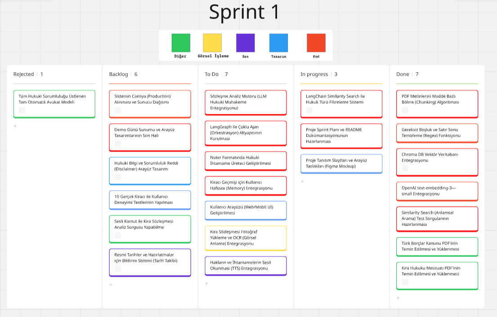

#### Tamamlanan İşler (Done)

| # | Görev | Kategori |
|---|---|---|
| 1 | PDF metinlerini madde bazlı bölme (Chunking) algoritması | Diğer |
| 2 | Gereksiz boşluk ve satır sonu temizleme (Regex) fonksiyonu | Diğer |
| 3 | Chroma DB vektör veritabanı entegrasyonu | Kod |
| 4 | OpenAI `text-embedding-3-small` entegrasyonu | Kod |
| 5 | Similarity Search (anlamsal arama) test sorgularının hazırlanması | Kod |
| 6 | Türk Borçlar Kanunu PDF'inin temin edilmesi ve yüklenmesi | Diğer |
| 7 | Kira Hukuku Mevzuatı PDF'inin temin edilmesi ve yüklenmesi | Diğer |

#### In Progress

- LangChain Similarity Search ile hukuk türü filtreleme sistemi
- Proje Sprint Planı ve README dokümantasyonu
- Proje tanıtım slaytları ve arayüz taslakları (Figma Mockup)

### Ürün Ekran Görüntüleri

#### Arayüz Taslağı

[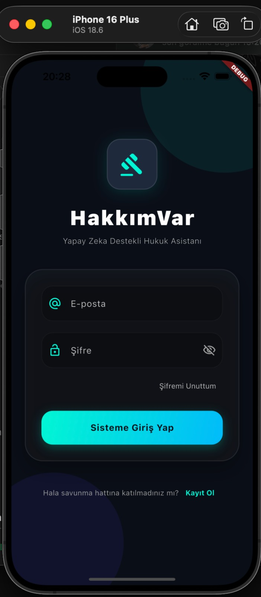](Sprint1/productss1.png)

### Daily Scrum

Sprint süresince Daily Scrum toplantıları **WhatsApp** yazışmaları ve **Google Meet** görüşmeleri aracılığıyla yürütülmüştür. Her toplantıda günlük ilerleme, tamamlanan görevler, karşılaşılan engeller ve bir sonraki adımlar değerlendirilmiştir.

<details>
<summary>Daily Scrum Ekran Görüntüleri (tıkla)</summary>

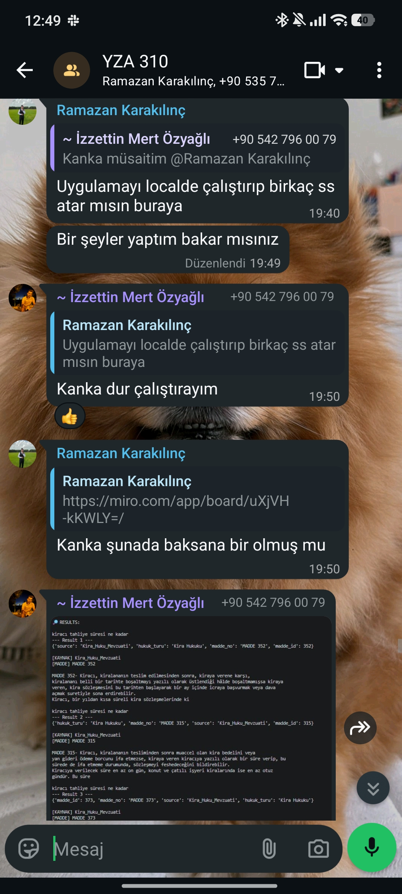
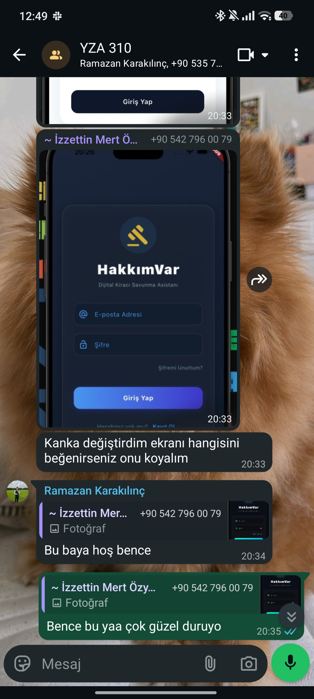
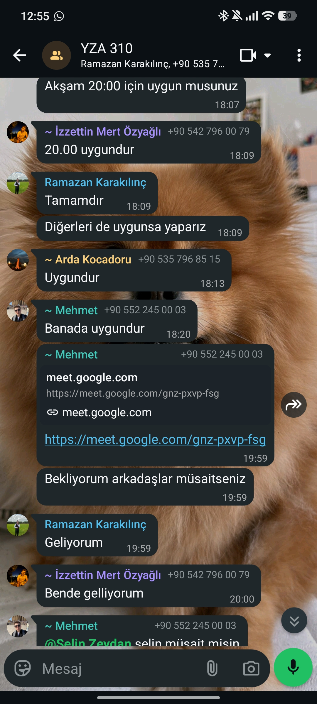
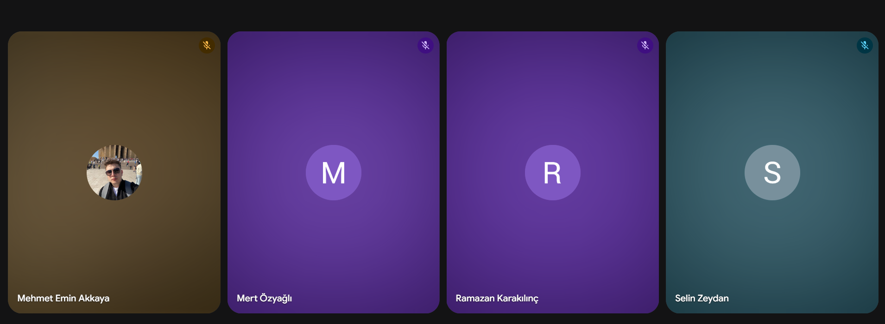

</details>

### Sprint Review

Sprint 1 kapsamında sözleşme analiz motorunun temel altyapısı başarıyla kurulmuştur:

- PDF işleme ve chunking pipeline'ı çalışır durumda
- Embedding ve Chroma DB entegrasyonu tamamlandı
- Türk Borçlar Kanunu + Kira Hukuku bilgi tabanı yüklendi
- Arayüz tasarımının ilk taslakları hazırlandı
- LangGraph çoklu ajan planlaması netleştirildi

### Sprint Retrospective

| Karar | Açıklama |
|---|---|
| **Task Bölünmesi** | Backlog story'leri daha küçük task'lere bölünecek |
| **Disclaimer** | Hukuki sorumluluk reddi arayüzü Sprint 2'ye öncelikli alındı |
| **Dokümantasyon** | Model seçimleri için ek teknik dokümantasyon hazırlanacak |

### Sprint 1 Klasör Yapısı

```
Sprint1/
├── VectorDatabase/
│   └── embedding.py          ← PDF chunking + Chroma DB yükleme
├── README.md
├── requirements.txt          ← Sprint 1 bağımlılıkları
├── sprint1_board.png         ← Sprint board ekran görüntüsü
├── productss1.png            ← Arayüz taslağı
└── Sprint_1_daily_scrum_ss_*.jpg/png  ← Daily Scrum görselleri
```

## Sprint 2 — Kurulum ve Çalıştırma

> **Sprint Dönemi:** 3–4. Haftalar | **Hedef:** LangGraph çoklu ajan, FastAPI backend, Streamlit UI

### Sprint Board


### Daily Scrum

Sprint süresince Daily Scrum toplantıları **WhatsApp** yazışmaları ve **Google Meet** görüşmeleri aracılığıyla yürütülmüştür. Her toplantıda günlük ilerleme, tamamlanan görevler, karşılaşılan engeller ve bir sonraki adımlar değerlendirilmiştir.

<details>
<summary>Daily Scrum Ekran Görüntüleri (tıkla)</summary>


</details>

---

## ✅ Sprint Review

Sprint 2 kapsamında yapay zekâ destekli kiracı hak asistanının temel fonksiyonları tamamlanarak çalışır bir MVP oluşturulmuştur.

- LangGraph tabanlı çoklu ajan mimarisi başarıyla geliştirildi.
- Contract Analyzer, Legal Reasoner ve Rights Advisor ajanları sisteme entegre edildi.
- FastAPI backend ve temel API servisleri tamamlandı.
- Streamlit tabanlı kullanıcı arayüzü geliştirilerek uçtan uca analiz akışı sağlandı.
- TÜFE bazlı kira artışı kontrolü ve ihtarname oluşturma özellikleri sisteme eklendi.
- RAG altyapısı ajan sistemiyle entegre edilerek hukuki değerlendirmelerin ilgili mevzuata dayandırılması sağlandı.

---

## 🔄 Sprint Retrospective

| Karar | Açıklama |
|-------|----------|
| Takım İletişimi | Daily Scrum toplantıları ve düzenli ekip iletişimi sayesinde sprint boyunca yaşanan teknik sorunlar hızlı bir şekilde çözüldü. Bu iletişim düzeninin sonraki sprintlerde de sürdürülmesine karar verildi. |
| Kod Entegrasyonu | Modüllerin entegrasyon sürecini daha verimli yönetebilmek amacıyla geliştirmelerin daha sık birleştirilmesi ve ara entegrasyon kontrollerinin artırılması planlandı. |
| Performans ve Geliştirme | Analiz süresini iyileştirmek ve kullanıcı deneyimini artırmak amacıyla performans optimizasyonları ile yeni özelliklerin Sprint 3 kapsamında önceliklendirilmesine karar verildi. |

---

### Hızlı Başlangıç

#### 1. .env dosyası oluştur

`Sprint2/` klasörüne `.env` dosyası oluştur ve API anahtarını ekle:

```
OPENAI_API_KEY=sk-...buraya_openai_api_keyin...
```

#### 2. Gereksinimleri yükle

```bash
pip install -r Sprint2/requirements.txt
```

#### 3. Vector Database'i oluştur (ilk seferinde bir kez çalıştır)

```bash
cd Sprint2/VectorDatabase
python embedding.py
cd ../..
```

#### 4. Uygulamayı başlat

```bash
cd Sprint2
streamlit run app.py
```

Tarayıcıda `http://localhost:8501` adresine git.

#### 5. (Opsiyonel) FastAPI backend'i başlat

```bash
cd Sprint2
uvicorn backend.main:app --reload
```

API dokümantasyonu: `http://localhost:8000/docs`

### Proje Yapısı (Sprint 2)

```
Sprint2/
├── VectorDatabase/
│   ├── embedding.py       ← PDF'leri Chroma'ya yükler
│   ├── retriever.py       ← RAG zinciri
│   ├── chroma_db/         ← (otomatik oluşur)
│   ├── Borçlar_kanunu.pdf
│   └── kira_hukuku.pdf
├── agents/
│   ├── contract_analyzer.py  ← Sözleşme okuma (text + OCR)
│   ├── legal_reasoner.py     ← TBK karşılaştırma + TÜFE
│   ├── rights_advisor.py     ← Hak danışmanlığı + ihtarname
│   └── graph.py              ← LangGraph orkestrasyonu
├── backend/
│   ├── main.py               ← FastAPI endpoints
│   └── models.py             ← Pydantic modeller
├── app.py                    ← Streamlit UI
├── requirements.txt
├── sprint2_board.png         ← Sprint board ekran görüntüsü
├── Sprint_2_daily_scrum_ss_*.jpeg  ← Daily Scrum görselleri
└── .env                      ← API key (git'e ekleme!)
```

---

## Sprint 3 — Mobil, Web ve Tam Entegrasyon

> **Sprint Dönemi:** 5–6. Haftalar | **Hedef:** Flutter mobil uygulama, React web arayüzü, C# backend API ve Python LangGraph ajan sisteminin tam entegrasyonu
---
### Sprint Board

[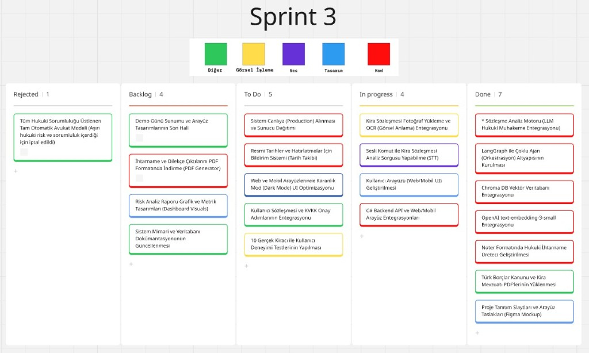](https://miro.com/app/board/uXjVH-kKWLY=/?share_link_id=566822862735)

---

## 🚀 Sprint 3'te Neler Tamamlandı?

Sprint 3, **HakkımVar**'ı 4 katmanlı tam yığın (full-stack) bir platforma dönüştüren en kapsamlı sprinttir:

- 📱 **Flutter Mobil Uygulama** — iOS & Android için native mobil uygulama geliştirildi
- 🌐 **React + TypeScript Web Arayüzü** — Vite tabanlı modern web uygulaması hayata geçirildi
- ⚙️ **C# ASP.NET Core 8 Backend** — JWT kimlik doğrulama, Entity Framework, SQL Server ile RESTful API
- 🤖 **Python LangGraph Ajan Sistemi** — Sözleşme analizi ve dilekçe üretimi için çift grafik mimarisi

---

### Ürün Ekran Görüntüleri

<details>
<summary>📱 Mobil Uygulama Ekran Görüntüleri (tıkla)</summary>

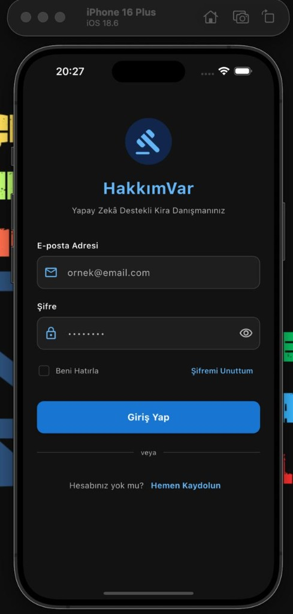
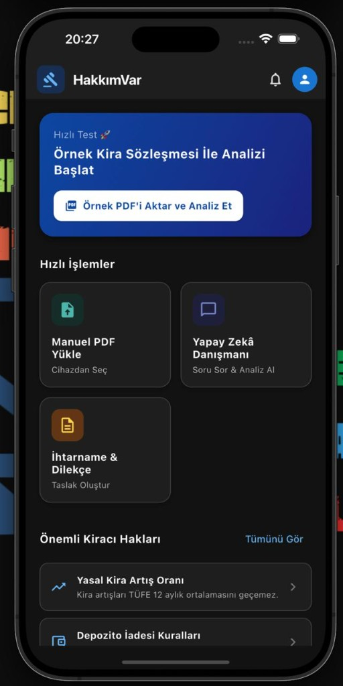
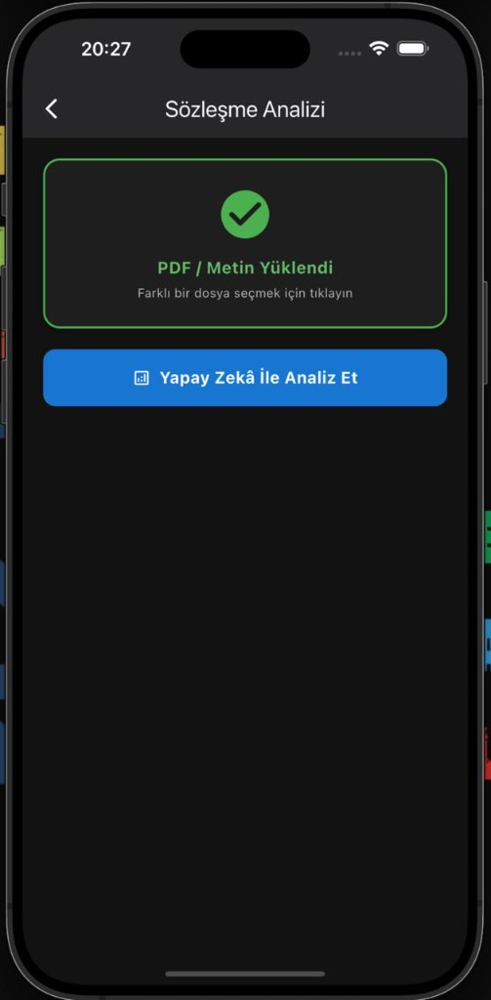
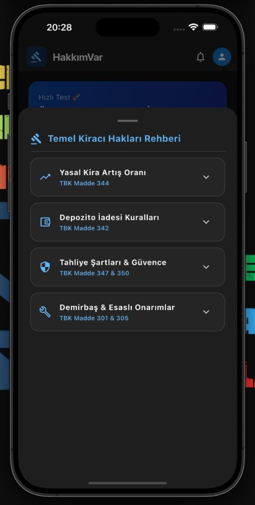
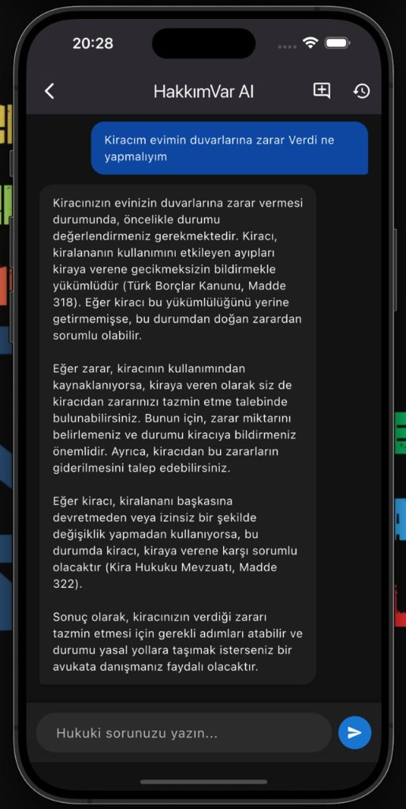
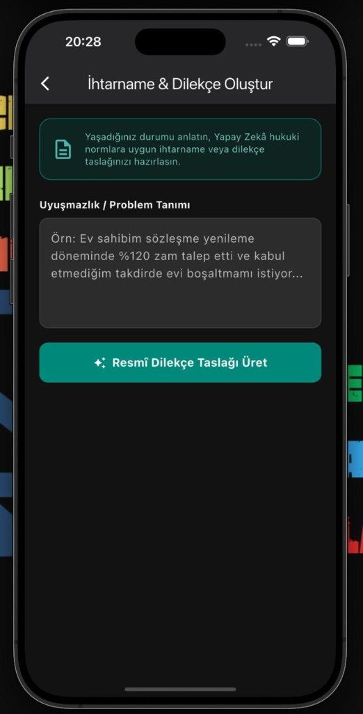

</details>
---

<details>
<summary>🌐 Web Arayüzü Ekran Görüntüleri (tıkla)</summary>

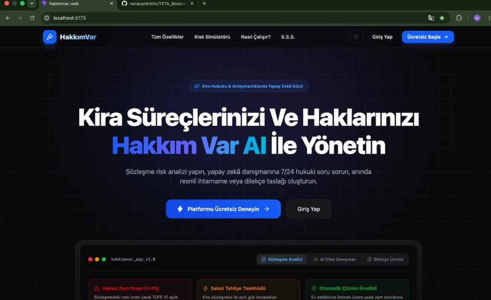
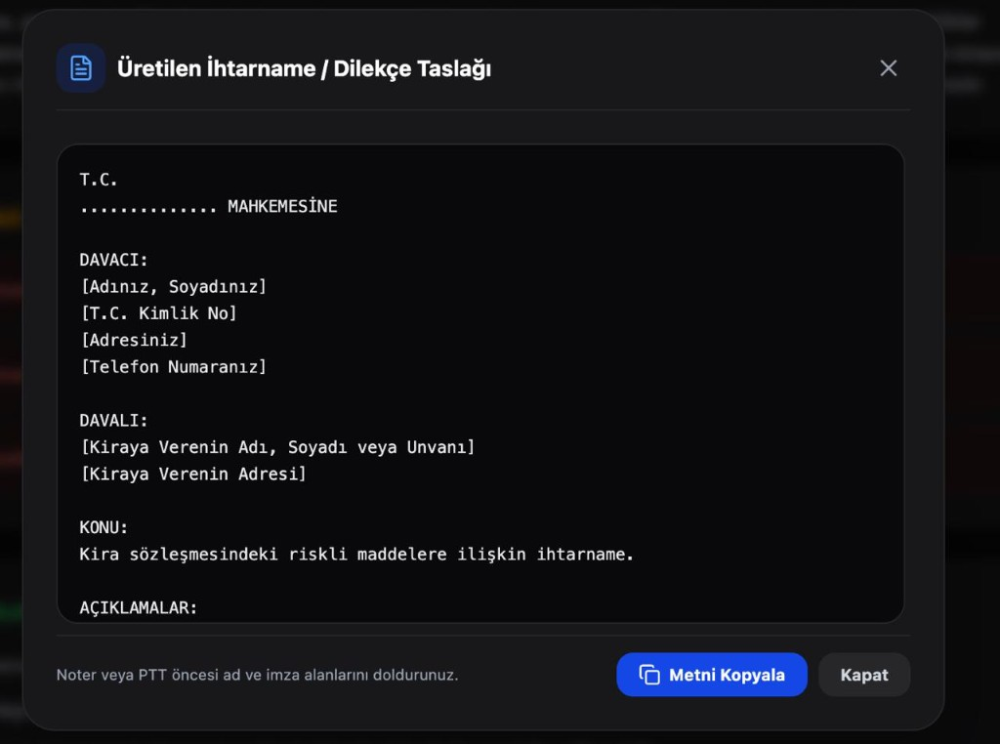
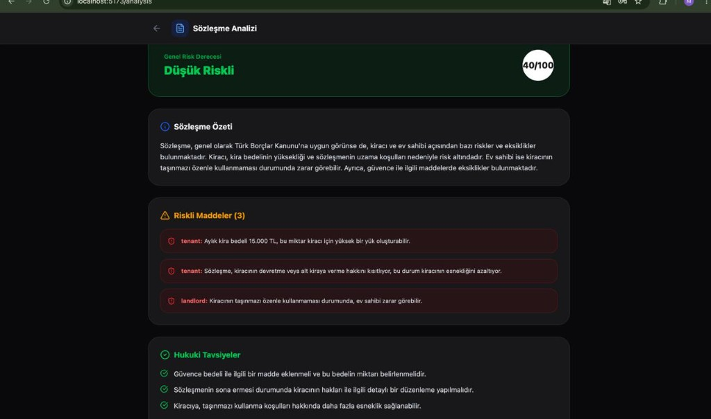

</details>

---

## 🎥 Demo Videosu

> 🎬 *[Ürün Demo Videosu](https://youtu.be/BfS_y94pE6Y)*

<!-- Demo videosu hazır olduğunda Sprint_3_demo.mp4 ve thumbnail olarak Sprint_3_video_thumb.png ekleyin -->

---


## 🤖 Python Ajan Sistemi (KiraAgent)

Sprint 3'te iki bağımsız LangGraph grafiği geliştirildi:

### Contract Graph — Sözleşme Analizi

| Node | Görev |
|---|---|
| `RouterNode` | Gelen isteği yönlendirir |
| `RetrieverNode` | Chroma DB'den ilgili hukuki maddeleri getirir |
| `ContractRetrieverNode` | Sözleşme metnini analiz için hazırlar |
| `ContractAnalysisNode` | LLM ile madde bazlı risk analizi yapar |
| `ContractSummaryNode` | Analiz özetini oluşturur |
| `AnswerCheckNode` | Çıktıyı doğrular |

### Petition Graph — Dilekçe Üretimi

| Node | Görev |
|---|---|
| `PetitionTypeNode` | Dilekçe türünü belirler |
| `PetitionRetrieverNode` | İlgili hukuki şablonları getirir |
| `PetitionGeneratorNode` | GPT-4o ile noter formatında dilekçe üretir |
| `AnswerCheckNode` | Çıktıyı doğrular |

---

## ⚙️ C# Backend API

ASP.NET Core 8 ile geliştirilen RESTful API aşağıdaki modülleri içermektedir:

| Controller | Endpoint | Açıklama |
|---|---|---|
| `AuthController` | `/api/auth` | Kayıt, giriş, JWT token yönetimi |
| `ContractController` | `/api/contract` | Sözleşme analizi (Python agent'a yönlendirir) |
| `ChatController` | `/api/chat` | Yapay zekâ sohbet oturumları |
| `PetitionController` | `/api/petition` | Dilekçe & ihtarname üretimi |
| `SessionController` | `/api/session` | Kullanıcı oturum yönetimi |
| `MessageController` | `/api/message` | Sohbet mesaj geçmişi |

**Altyapı:** Entity Framework Core 8 · SQL Server · BCrypt · JWT Bearer · Swagger/OpenAPI

---

## 📱 Flutter Mobil Uygulama

| Ekran | Açıklama |
|---|---|
| `login_screen.dart` | E-posta & şifre ile giriş |
| `Register.dart` | Yeni kullanıcı kaydı |
| `home_screen.dart` | Ana sayfa ve hızlı işlemler |
| `home_dashboard_screen.dart` | Kullanıcı dashboard'u |
| `contract_analysis_screen.dart` | PDF yükleme & sözleşme analizi |
| `petition_screen.dart` | İhtarname & dilekçe oluşturma |
| `faq_screen.dart` | Kiracı hakları rehberi |
| `profile_screen.dart` | Kullanıcı profili |

---

## 🌐 React Web Uygulaması

| Sayfa | Açıklama |
|---|---|
| `LandingPage.tsx` | Pazarlama ana sayfası |
| `Login.tsx` / `Register.tsx` | Kimlik doğrulama |
| `HomeDashboard.tsx` | Kullanıcı dashboard'u |
| `ContractAnalysis.tsx` | PDF yükleme & sözleşme analizi |
| `AiChat.tsx` | Yapay zekâ sohbet arayüzü |
| `Petition.tsx` | Dilekçe üretici |
| `Profile.tsx` | Kullanıcı profili |

---

## 🛠️ Teknoloji Yığını

```
Mobil             │ Flutter 3.x (iOS & Android)
Web               │ React 18 + TypeScript 5 + Vite
Backend           │ ASP.NET Core 8, Entity Framework Core, SQL Server, JWT
Yapay Zekâ        │ GPT-4o, text-embedding-3-small
Ajan Mimarisi     │ LangGraph (Contract Graph + Petition Graph), LangChain, RAG
Vektör Veritabanı │ Chroma DB
Hukuki Kaynaklar  │ Türk Borçlar Kanunu PDF, Kira Hukuku Mevzuatı PDF
```

---

## 🚀 Hızlı Başlangıç

### 🤖 Python Ajan Sistemi (KiraAgent)

```bash
cd KiraAgent
pip install -r requirements.txt
# .env dosyasına OPENAI_API_KEY ekle
python main.py
```

### ⚙️ C# Backend

```bash
cd Sprint3/Backend/Backend
# appsettings.json içinde connection string'i güncelle
dotnet restore
dotnet run
```

Swagger: http://localhost:5000/swagger

### 🌐 React Web Uygulaması

```bash
cd Web/hakkimvar-web
npm install
npm run dev
```

Web: http://localhost:5173

### 📱 Flutter Mobil Uygulama

```bash
cd Sprint3/mobil_arayuz
flutter pub get
flutter run
```

---

## 📁 Sprint 3 Klasör Yapısı

```
Sprint3/
├── Backend/                         ← C# ASP.NET Core 8 Backend
│   └── Backend/
│       ├── Controllers/             ← Auth, Chat, Contract, Petition, Session
│       ├── Services/                ← İş mantığı katmanı
│       ├── Repositories/            ← Veri erişim katmanı
│       ├── Entities/                ← User, ChatSession, ChatMessage
│       ├── Interfaces/              ← Soyutlama katmanı
│       ├── Migrations/              ← EF Core veritabanı migration'ları
│       └── Program.cs               ← Uygulama giriş noktası
│
├── mobil_arayuz/                    ← Flutter Mobil Uygulama (iOS/Android)
│   └── lib/
│       ├── LoginPages/              ← Giriş & kayıt ekranları
│       ├── pages/                   ← Ana ekranlar
│       ├── models/                  ← Veri modelleri
│       ├── services/                ← API servis katmanı
│       └── utils/                   ← Token yönetimi, tema, sabitler
│
├── README.md                        ← Bu dosya
├── sprint3_board.png                ← Sprint board ekran görüntüsü
├── Sprint_3_daily_scrum_ss_*.png    ← Daily Scrum görselleri
└── Sprint_3_app_*.png               ← Uygulama ekran görüntüleri

Web/hakkimvar-web/                   ← React + TypeScript Web Uygulaması
├── src/
│   ├── pages/                       ← Landing, Login, Dashboard, Contract, Chat, Petition
│   ├── components/                  ← RightsDetailModal, TermsModal
│   ├── services/                    ← api, authService, pdfService
│   ├── context/                     ← ThemeContext
│   └── utils/                       ← tokenManager
└── package.json

KiraAgent/                           ← Python LangGraph Ajan Sistemi
├── nodes/                           ← LangGraph node'ları
├── chains/                          ← LLM zincirleri
├── VectorDatabase/                  ← Chroma DB + PDF'ler
├── contract_graph.py                ← Sözleşme analiz grafiği
├── petition_graph.py                ← Dilekçe üretim grafiği
└── main.py                          ← Ana giriş noktası
```

---

## 📅 Daily Scrum

Sprint süresince Daily Scrum toplantıları **WhatsApp** yazışmaları ve **Google Meet** görüşmeleri aracılığıyla yürütülmüştür. Her toplantıda günlük ilerleme, tamamlanan görevler, karşılaşılan engeller ve bir sonraki adımlar değerlendirilmiştir.

<details>
<summary>📸 Daily Scrum Ekran Görüntüleri (tıkla)</summary>


</details>

---

## 📊 Sprint Review

Sprint 3 kapsamında **HakkımVar** belge oluşturma süreçleri tamamlanmış ve kullanıcıların yapay zekâ ile etkileşim kurabileceği yeni özellikler sisteme kazandırılmıştır.

- ✅ Kullanıcıların PDF formatındaki kira sözleşmelerini yükleyerek analiz edebileceği sözleşme analiz ekranı geliştirildi.
- ✅ Analiz sonucunda risk skoru, analiz özeti ve riskli sözleşme maddelerinin kart yapısında görüntülenmesi sağlandı.
- ✅ Document Generator Agent geliştirilerek tespit edilen risklere özel ihtarname ve dilekçe taslaklarının tek tıkla oluşturulması sağlandı.
- ✅ Oluşturulan hukuki belgelerin PDF formatında görüntülenmesi ve indirilebilmesi desteklendi.
- ✅ HakkımVar AI sohbet modülü geliştirilerek kullanıcıların kira hukuku ile ilgili sorularını doğal dilde yöneltebilmesi ve mevzuata uygun yanıtlar alabilmesi sağlandı.
- ✅ Backend altyapısı ekip tarafından geliştirilerek yeni modüllerin sistemle entegrasyonu tamamlandı.

---

## 🔁 Sprint Retrospective

| Karar | Açıklama |
|---|---|
| 🤝 **Takım İçi Koordinasyon** | Backend, yapay zekâ ajanları ve kullanıcı arayüzü geliştirmeleri eş zamanlı yürütüldü. Düzenli ekip iletişimi sayesinde entegrasyon süreci planlandığı şekilde tamamlandı. |
| ⚡ **Belge Üretim Süreci** | Dilekçe oluşturma ve analiz sonuçlarının kullanıcıya sunulması sırasında edinilen deneyimler doğrultusunda belge şablonlarının ve çıktı formatlarının geliştirilmeye devam edilmesine karar verildi. |
| 🎨 **Demo Hazırlığı** | Son sprintte performans optimizasyonu, kullanıcı deneyimi iyileştirmeleri ve kapsamlı sistem testlerine öncelik verilmesine karar verildi. |

---

## 🗺️ Sprint Planı

| Sprint | Dönem | Hedef | Durum |
|---|---|---|---|
| ✅ **[Sprint 1](../Sprint1/)** | 1–2. Hafta | Temel altyapı, PDF işleme, embedding | Tamamlandı |
| ✅ **[Sprint 2](../Sprint2/)** | 3–4. Hafta | Ajan sistemi, RAG, FastAPI, Streamlit UI | Tamamlandı |
| ✅ **Sprint 3** | 5–6. Hafta | Flutter mobil, React web, C# backend, LangGraph tam entegrasyon | Tamamlandı |

<div align="center">

---

## Takım

**YZTA Bootcamp 2026 — Takım 310**

| İsim | Rol | Sorumluluk |
|------|-----|------------|
| **Ramazan Karakılınç** | Product Owner | Ürün vizyonu, backlog yönetimi, önceliklendirme |
| **Selin Zeydan** | Scrum Master | Sprint planlaması, süreç kolaylaştırma, engel kaldırma |
| **Arda Kocadoru** | Developer | Ajan mimarisi, LangGraph orkestrasyonu |
| **İzzet Mert Özyağlı** | Developer | FastAPI backend, RAG entegrasyonu |
| **Mehmet Emin Akkaya** | Developer | Streamlit UI, veri modelleri |

---

## API Endpoint Referansı

| Method | Endpoint | Açıklama |
|--------|----------|----------|
| `GET` | `/health` | Servis sağlık kontrolü |
| `POST` | `/analyze/text` | Metin sözleşmesi tam analiz zinciri |
| `POST` | `/analyze/image` | Fotoğraf/PDF sözleşmesi OCR analizi |
| `POST` | `/rent-check` | TÜFE bazlı kira artışı kontrolü |
| `POST` | `/law-search` | TBK'da semantik kanun maddesi arama |
| `POST` | `/ihtarname` | Bağımsız ihtarname taslağı üretimi |

---

## Hukuki Uyarı

HakkımVar bir **hukuki bilgi aracıdır**, hukuki tavsiye niteliği taşımaz. Sistem tarafından üretilen analizler ve belgeler bir avukatın görüşünün yerini alamaz. Hukuki uyuşmazlıklarınızda mutlaka bir avukattan profesyonel destek alınız.

---

<div align="center">

**HakkımVar** · YZTA Bootcamp 2026 · Takım 310

*Türkiye'deki her kiracının hakkını bilmesi için.*

</div>
