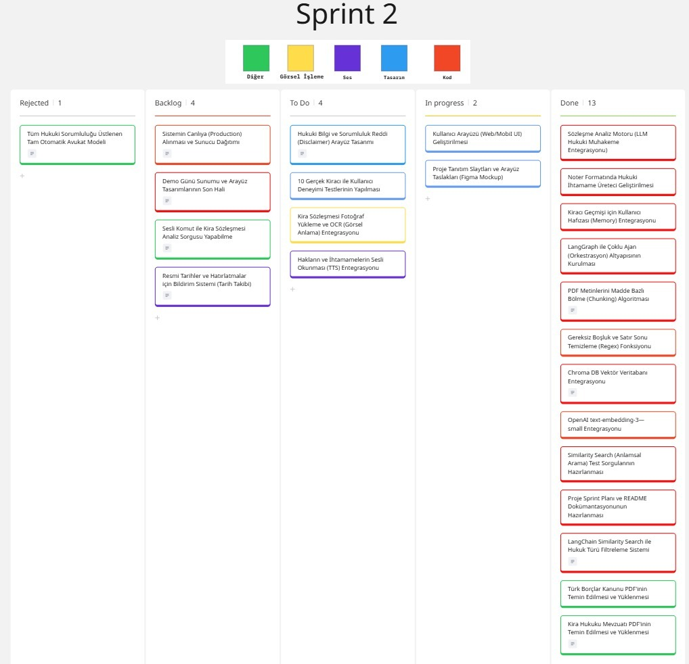
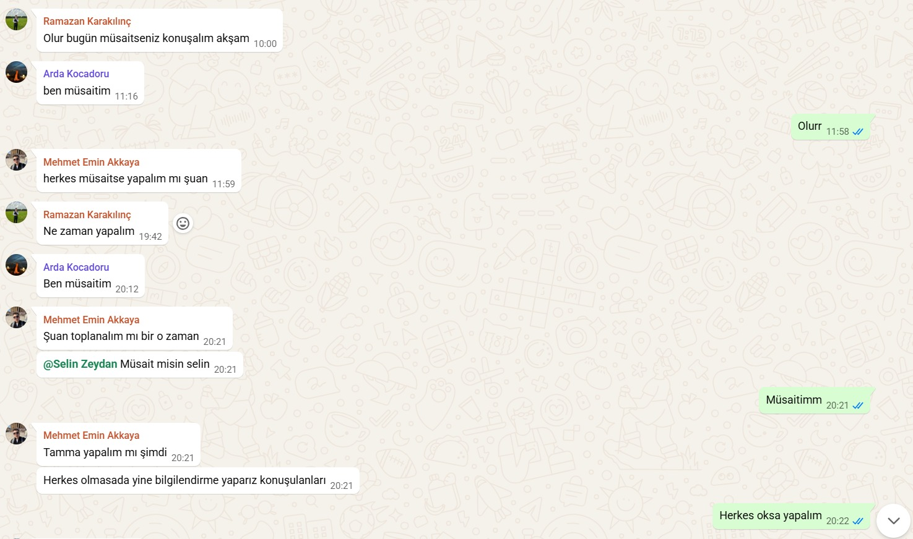
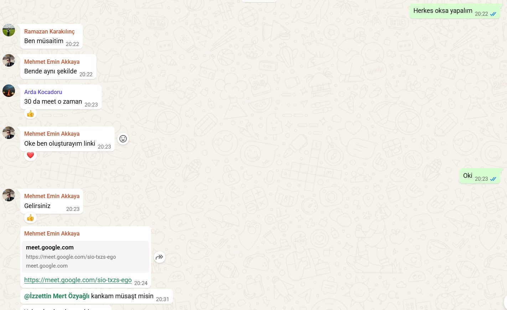
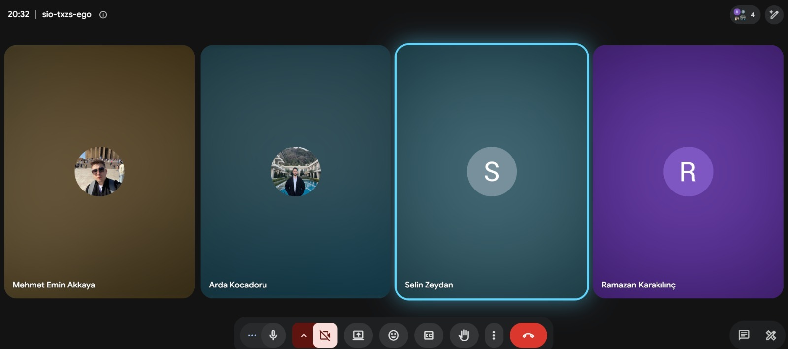

# ⚖️ HakkımVar — Sprint 2 Kurulum & Çalıştırma

<<<<<<< HEAD
=======
> **Sprint Dönemi:** 3–4. Haftalar | **Hedef:** LangGraph çoklu ajan, FastAPI backend, Streamlit UI

---

## 📊 Sprint Board



---

## 📅 Daily Scrum

Sprint süresince Daily Scrum toplantıları **WhatsApp** yazışmaları ve **Google Meet** görüşmeleri aracılığıyla yürütülmüştür. Her toplantıda günlük ilerleme, tamamlanan görevler, karşılaşılan engeller ve bir sonraki adımlar değerlendirilmiştir.

<details>
<summary>📸 Daily Scrum Ekran Görüntüleri (tıkla)</summary>





</details>

---

>>>>>>> origin/master
## 🚀 Hızlı Başlangıç

### 1. .env dosyası oluştur

Proje klasörüne `.env` dosyası oluştur ve API anahtarını ekle:
```
OPENAI_API_KEY=sk-...buraya_openai_api_keyin...
```

### 2. Gereksinimleri yükle

```bash
pip install -r requirements.txt
```

### 3. Vector Database'i oluştur (ilk seferinde bir kez çalıştır)

```bash
cd VectorDatabase
python embedding.py
cd ..
```

### 4. Uygulamayı başlat

```bash
streamlit run app.py
```

### 5. (Opsiyonel) FastAPI backend'i başlat

```bash
uvicorn backend.main:app --reload
```
API dokümantasyonu: http://localhost:8000/docs

---

## 📁 Proje Yapısı (Sprint 2)

```
YZTA_Bootcamp_310/
├── VectorDatabase/
│   ├── embedding.py       ← PDF'leri Chroma'ya yükler
│   ├── retriever.py       ← RAG zinciri
│   ├── chroma_db/         ← (otomatik oluşur)
│   ├── Borçlar_kanunu.pdf
│   └── kira_hukuku.pdf
├── agents/
│   ├── contract_analyzer.py  ← Sözleşme okuma (text + OCR)
│   ├── legal_reasoner.py     ← TBK karşılaştırma + TÜFE
│   ├── rights_advisor.py     ← Hak danışmanlığı + ihtarname
│   └── graph.py              ← LangGraph orkestrasyonu
├── backend/
│   ├── main.py               ← FastAPI endpoints
│   └── models.py             ← Pydantic modeller
├── app.py                    ← Streamlit UI
├── requirements.txt
<<<<<<< HEAD
=======
├── sprint2_board.png         ← Sprint board ekran görüntüsü
├── Sprint_2_daily_scrum_ss_*.jpeg  ← Daily Scrum görselleri
>>>>>>> origin/master
└── .env                      ← API key (git'e ekleme!)
```
