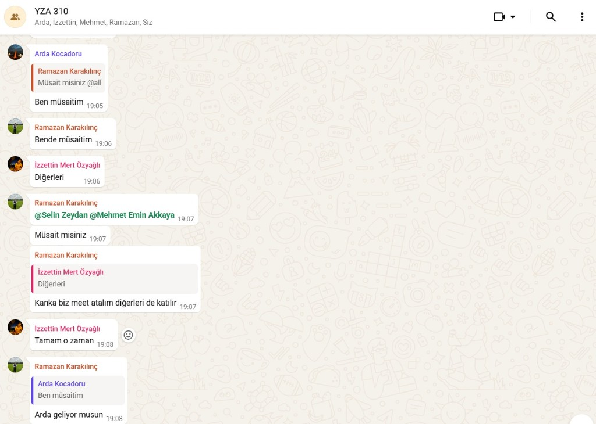
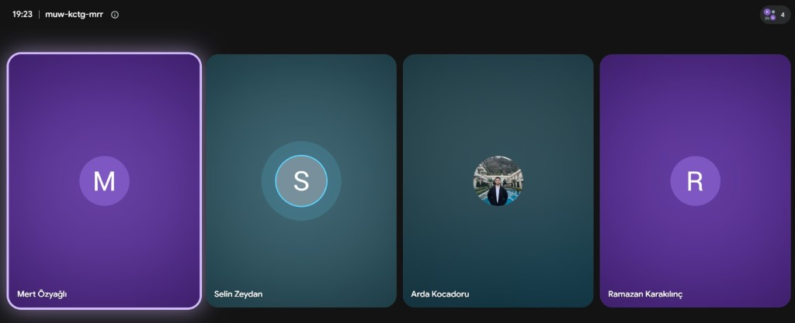
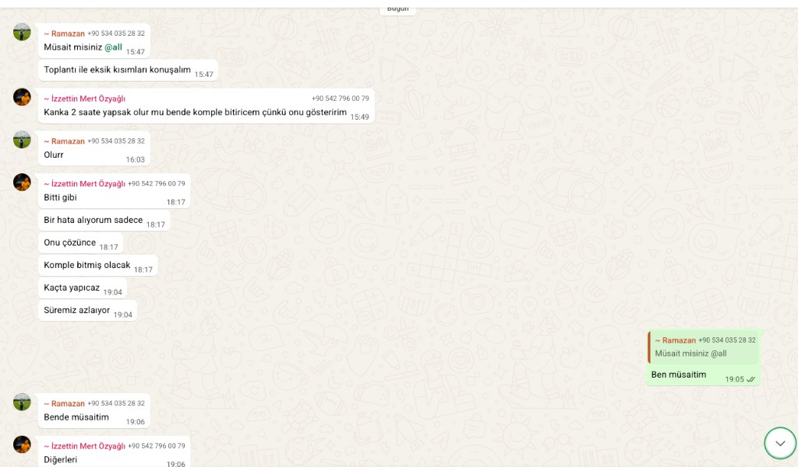

<div align="center">

# ⚖️ HakkımVar — Sprint 3

### *Yapay Zekâ Destekli Kiracı Hak Asistanı*

[](https://flutter.dev)
[](https://react.dev)
[](https://www.typescriptlang.org)
[](https://dotnet.microsoft.com)
[](https://python.org)
[](https://langchain-ai.github.io/langgraph)
[](https://openai.com)
[](LICENSE)

**Türkiye'deki 40 milyonu aşkın kiracı için hukuki asistan**

[📋 Sprint 3 Board](https://miro.com/app/board/uXjVH-kKWLY=/?share_link_id=566822862735) • [⬅️ Sprint 2](../Sprint2/) • [📄 Yol Haritası](../Road_Map1.pdf)

</div>

---

> **Sprint Dönemi:** 5–6. Haftalar | **Hedef:** Flutter mobil uygulama, React web arayüzü, C# backend API ve Python LangGraph ajan sisteminin tam entegrasyonu

---

## 👥 Takım — HakkımVar Takımı

| İsim | Rol |
|---|---|
| **Ramazan Karakılınç** | 🎯 Product Owner |
| **Selin Zeydan** | 🔄 Scrum Master |
| **Arda Kocadoru** | 💻 Developer |
| **İzzet Mert Özyağlı** | 💻 Developer |
| **Mehmet Emin Akkaya** | 💻 Developer |

---

## 📊 Sprint Board

[](https://miro.com/app/board/uXjVH-kKWLY=/?share_link_id=566822862735)

---

## 🚀 Sprint 3'te Neler Tamamlandı?

Sprint 3, **HakkımVar**'ı 4 katmanlı tam yığın (full-stack) bir platforma dönüştüren en kapsamlı sprinttir:

- 📱 **Flutter Mobil Uygulama** — iOS & Android için native mobil uygulama geliştirildi
- 🌐 **React + TypeScript Web Arayüzü** — Vite tabanlı modern web uygulaması hayata geçirildi
- ⚙️ **C# ASP.NET Core 8 Backend** — JWT kimlik doğrulama, Entity Framework, SQL Server ile RESTful API
- 🤖 **Python LangGraph Ajan Sistemi** — Sözleşme analizi ve dilekçe üretimi için çift grafik mimarisi

---

## ✅ Tamamlanan İşler (Done)

| # | Görev | Kategori |
|---|---|---|
| 1 | Sözleşme Analiz Motoru (LLM Hukuki Muhakeme Entegrasyonu) | 🔴 Kod |
| 2 | LangGraph ile Çoklu Ajan (Orkestrasyon) Altyapısının Kurulması | 🔴 Kod |
| 3 | Chroma DB Vektör Veritabanı Entegrasyonu | 🔴 Kod |
| 4 | OpenAI text-embedding-3-small Entegrasyonu | 🔴 Kod |
| 5 | Noter Formatında Hukuki İhtarname Üreteci Geliştirilmesi | 🟢 Diğer |
| 6 | Türk Borçlar Kanunu ve Kira Mevzuatı PDF'lerinin Yüklenmesi | 🟢 Diğer |
| 7 | Proje Tanıtım Slaytları ve Arayüz Taslakları (Figma Mockup) | 🟡 Tasarım |


## 🖥️ Ürün Ekran Görüntüleri

<details>
<summary>📱 Mobil Uygulama Ekran Görüntüleri (tıkla)</summary>

### Giriş Ekranı


### Ana Sayfa


### Sözleşme Analizi — PDF Yükleme


### Yapay Zekâ Chat Danışmanı


### İhtarname & Dilekçe Oluştur


### Temel Kiracı Hakları Rehberi


</details>

<details>
<summary>🌐 Web Arayüzü Ekran Görüntüleri (tıkla)</summary>

### Ana Sayfa


### İhtarname / Dilekçe Taslağı Popup


### Dilekçe Üretici


</details>

---

## 🎥 Demo Videosu

> 🎬 *Demo videosu hazır olduğunda buraya eklenecektir.*

<!-- Demo videosu hazır olduğunda Sprint_3_demo.mp4 ve thumbnail olarak Sprint_3_video_thumb.png ekleyin -->

---

## 🏗️ Sistem Mimarisi

Sprint 3 ile birlikte HakkımVar, 4 bağımsız katmandan oluşan tam yığın bir platforma dönüştü:

```
┌─────────────────────────────────────────────────────────────────┐
│                        İstemci Katmanı                          │
│                                                                 │
│   📱 Flutter (iOS/Android)        🌐 React + TypeScript (Web)  │
└──────────────────────┬──────────────────────────────┬──────────┘
                       │ HTTP / REST API               │
┌──────────────────────▼──────────────────────────────▼──────────┐
│                 ⚙️ C# ASP.NET Core 8 Backend                   │
│                                                                 │
│  AuthController │ ContractController │ ChatController           │
│  PetitionController │ SessionController │ MessageController     │
│                                                                 │
│  JWT Auth │ Entity Framework │ SQL Server │ BCrypt              │
└──────────────────────────────┬──────────────────────────────────┘
                               │ HTTP (Python Agent Service)
┌──────────────────────────────▼──────────────────────────────────┐
│               🤖 Python LangGraph Ajan Sistemi                  │
│                                                                 │
│  ┌─────────────────────┐    ┌──────────────────────────────┐   │
│  │  Contract Graph      │    │      Petition Graph           │   │
│  │                      │    │                               │   │
│  │ Router → Retriever   │    │ Router → PetitionType         │   │
│  │ → Analyzer → Summary │    │ → Retriever → Generator       │   │
│  │ → AnswerCheck        │    │ → AnswerCheck                 │   │
│  └─────────────────────┘    └──────────────────────────────┘   │
│                                                                 │
│                   🗄️ Chroma DB (RAG)                           │
│          Türk Borçlar Kanunu + Kira Hukuku Mevzuatı            │
└─────────────────────────────────────────────────────────────────┘
```

---

## 🤖 Python Ajan Sistemi (KiraAgent)

Sprint 3'te iki bağımsız LangGraph grafiği geliştirildi:

### Contract Graph — Sözleşme Analizi

| Node | Görev |
|---|---|
| `RouterNode` | Gelen isteği yönlendirir |
| `RetrieverNode` | Chroma DB'den ilgili hukuki maddeleri getirir |
| `ContractRetrieverNode` | Sözleşme metnini analiz için hazırlar |
| `ContractAnalysisNode` | LLM ile madde bazlı risk analizi yapar |
| `ContractSummaryNode` | Analiz özetini oluşturur |
| `AnswerCheckNode` | Çıktıyı doğrular |

### Petition Graph — Dilekçe Üretimi

| Node | Görev |
|---|---|
| `PetitionTypeNode` | Dilekçe türünü belirler |
| `PetitionRetrieverNode` | İlgili hukuki şablonları getirir |
| `PetitionGeneratorNode` | GPT-4o ile noter formatında dilekçe üretir |
| `AnswerCheckNode` | Çıktıyı doğrular |

---

## ⚙️ C# Backend API

ASP.NET Core 8 ile geliştirilen RESTful API aşağıdaki modülleri içermektedir:

| Controller | Endpoint | Açıklama |
|---|---|---|
| `AuthController` | `/api/auth` | Kayıt, giriş, JWT token yönetimi |
| `ContractController` | `/api/contract` | Sözleşme analizi (Python agent'a yönlendirir) |
| `ChatController` | `/api/chat` | Yapay zekâ sohbet oturumları |
| `PetitionController` | `/api/petition` | Dilekçe & ihtarname üretimi |
| `SessionController` | `/api/session` | Kullanıcı oturum yönetimi |
| `MessageController` | `/api/message` | Sohbet mesaj geçmişi |

**Altyapı:** Entity Framework Core 8 · SQL Server · BCrypt · JWT Bearer · Swagger/OpenAPI

---

## 📱 Flutter Mobil Uygulama

| Ekran | Açıklama |
|---|---|
| `login_screen.dart` | E-posta & şifre ile giriş |
| `Register.dart` | Yeni kullanıcı kaydı |
| `home_screen.dart` | Ana sayfa ve hızlı işlemler |
| `home_dashboard_screen.dart` | Kullanıcı dashboard'u |
| `contract_analysis_screen.dart` | PDF yükleme & sözleşme analizi |
| `petition_screen.dart` | İhtarname & dilekçe oluşturma |
| `faq_screen.dart` | Kiracı hakları rehberi |
| `profile_screen.dart` | Kullanıcı profili |

---

## 🌐 React Web Uygulaması

| Sayfa | Açıklama |
|---|---|
| `LandingPage.tsx` | Pazarlama ana sayfası |
| `Login.tsx` / `Register.tsx` | Kimlik doğrulama |
| `HomeDashboard.tsx` | Kullanıcı dashboard'u |
| `ContractAnalysis.tsx` | PDF yükleme & sözleşme analizi |
| `AiChat.tsx` | Yapay zekâ sohbet arayüzü |
| `Petition.tsx` | Dilekçe üretici |
| `Profile.tsx` | Kullanıcı profili |

---

## 🛠️ Teknoloji Yığını

```
Mobil             │ Flutter 3.x (iOS & Android)
Web               │ React 18 + TypeScript 5 + Vite
Backend           │ ASP.NET Core 8, Entity Framework Core, SQL Server, JWT
Yapay Zekâ        │ GPT-4o, text-embedding-3-small
Ajan Mimarisi     │ LangGraph (Contract Graph + Petition Graph), LangChain, RAG
Vektör Veritabanı │ Chroma DB
Hukuki Kaynaklar  │ Türk Borçlar Kanunu PDF, Kira Hukuku Mevzuatı PDF
```

---

## 🚀 Hızlı Başlangıç

### 🤖 Python Ajan Sistemi (KiraAgent)

```bash
cd KiraAgent
pip install -r requirements.txt
# .env dosyasına OPENAI_API_KEY ekle
python main.py
```

### ⚙️ C# Backend

```bash
cd Sprint3/Backend/Backend
# appsettings.json içinde connection string'i güncelle
dotnet restore
dotnet run
```

Swagger: http://localhost:5000/swagger

### 🌐 React Web Uygulaması

```bash
cd Web/hakkimvar-web
npm install
npm run dev
```

Web: http://localhost:5173

### 📱 Flutter Mobil Uygulama

```bash
cd Sprint3/mobil_arayuz
flutter pub get
flutter run
```

---

## 📁 Sprint 3 Klasör Yapısı

```
Sprint3/
├── Backend/                         ← C# ASP.NET Core 8 Backend
│   └── Backend/
│       ├── Controllers/             ← Auth, Chat, Contract, Petition, Session
│       ├── Services/                ← İş mantığı katmanı
│       ├── Repositories/            ← Veri erişim katmanı
│       ├── Entities/                ← User, ChatSession, ChatMessage
│       ├── Interfaces/              ← Soyutlama katmanı
│       ├── Migrations/              ← EF Core veritabanı migration'ları
│       └── Program.cs               ← Uygulama giriş noktası
│
├── mobil_arayuz/                    ← Flutter Mobil Uygulama (iOS/Android)
│   └── lib/
│       ├── LoginPages/              ← Giriş & kayıt ekranları
│       ├── pages/                   ← Ana ekranlar
│       ├── models/                  ← Veri modelleri
│       ├── services/                ← API servis katmanı
│       └── utils/                   ← Token yönetimi, tema, sabitler
│
├── README.md                        ← Bu dosya
├── sprint3_board.png                ← Sprint board ekran görüntüsü
├── Sprint_3_daily_scrum_ss_*.png    ← Daily Scrum görselleri
└── Sprint_3_app_*.png               ← Uygulama ekran görüntüleri

Web/hakkimvar-web/                   ← React + TypeScript Web Uygulaması
├── src/
│   ├── pages/                       ← Landing, Login, Dashboard, Contract, Chat, Petition
│   ├── components/                  ← RightsDetailModal, TermsModal
│   ├── services/                    ← api, authService, pdfService
│   ├── context/                     ← ThemeContext
│   └── utils/                       ← tokenManager
└── package.json

KiraAgent/                           ← Python LangGraph Ajan Sistemi
├── nodes/                           ← LangGraph node'ları
├── chains/                          ← LLM zincirleri
├── VectorDatabase/                  ← Chroma DB + PDF'ler
├── contract_graph.py                ← Sözleşme analiz grafiği
├── petition_graph.py                ← Dilekçe üretim grafiği
└── main.py                          ← Ana giriş noktası
```

---

## 📅 Daily Scrum

Sprint süresince Daily Scrum toplantıları **WhatsApp** yazışmaları ve **Google Meet** görüşmeleri aracılığıyla yürütülmüştür. Her toplantıda günlük ilerleme, tamamlanan görevler, karşılaşılan engeller ve bir sonraki adımlar değerlendirilmiştir.

<details>
<summary>📸 Daily Scrum Ekran Görüntüleri (tıkla)</summary>





</details>

---

## 📊 Sprint Review

Sprint 3 kapsamında **HakkımVar** belge oluşturma süreçleri tamamlanmış ve kullanıcıların yapay zekâ ile etkileşim kurabileceği yeni özellikler sisteme kazandırılmıştır.

- ✅ Kullanıcıların PDF formatındaki kira sözleşmelerini yükleyerek analiz edebileceği sözleşme analiz ekranı geliştirildi.
- ✅ Analiz sonucunda risk skoru, analiz özeti ve riskli sözleşme maddelerinin kart yapısında görüntülenmesi sağlandı.
- ✅ Document Generator Agent geliştirilerek tespit edilen risklere özel ihtarname ve dilekçe taslaklarının tek tıkla oluşturulması sağlandı.
- ✅ Oluşturulan hukuki belgelerin PDF formatında görüntülenmesi ve indirilebilmesi desteklendi.
- ✅ HakkımVar AI sohbet modülü geliştirilerek kullanıcıların kira hukuku ile ilgili sorularını doğal dilde yöneltebilmesi ve mevzuata uygun yanıtlar alabilmesi sağlandı.
- ✅ Backend altyapısı ekip tarafından geliştirilerek yeni modüllerin sistemle entegrasyonu tamamlandı.

---

## 🔁 Sprint Retrospective

| Karar | Açıklama |
|---|---|
| 🤝 **Takım İçi Koordinasyon** | Backend, yapay zekâ ajanları ve kullanıcı arayüzü geliştirmeleri eş zamanlı yürütüldü. Düzenli ekip iletişimi sayesinde entegrasyon süreci planlandığı şekilde tamamlandı. |
| ⚡ **Belge Üretim Süreci** | Dilekçe oluşturma ve analiz sonuçlarının kullanıcıya sunulması sırasında edinilen deneyimler doğrultusunda belge şablonlarının ve çıktı formatlarının geliştirilmeye devam edilmesine karar verildi. |
| 🎨 **Demo Hazırlığı** | Son sprintte performans optimizasyonu, kullanıcı deneyimi iyileştirmeleri ve kapsamlı sistem testlerine öncelik verilmesine karar verildi. |

---

## 🗺️ Sprint Planı

| Sprint | Dönem | Hedef | Durum |
|---|---|---|---|
| ✅ **[Sprint 1](../Sprint1/)** | 1–2. Hafta | Temel altyapı, PDF işleme, embedding | Tamamlandı |
| ✅ **[Sprint 2](../Sprint2/)** | 3–4. Hafta | Ajan sistemi, RAG, FastAPI, Streamlit UI | Tamamlandı |
| ✅ **Sprint 3** | 5–6. Hafta | Flutter mobil, React web, C# backend, LangGraph tam entegrasyon | Tamamlandı |

---

<div align="center">

**⚖️ HakkımVar** | YZTA Bootcamp 310 | Takım 310

*Bu uygulama hukuki tavsiye niteliği taşımaz. Profesyonel hukuki destek için bir avukata danışınız.*

</div>
